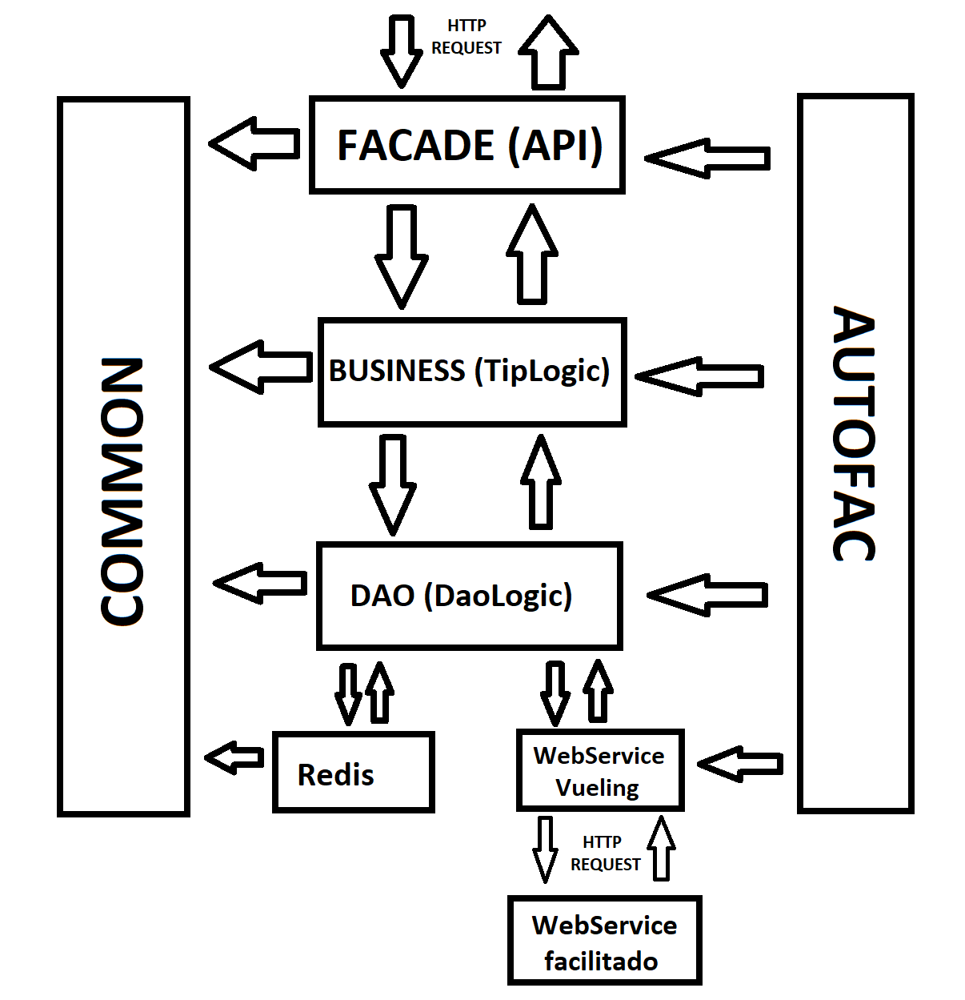
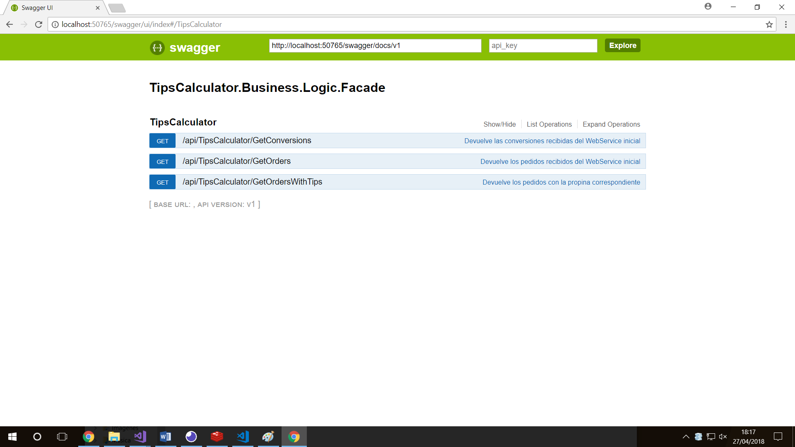

# Examen Tips Calculator

## Arquitectura: N-Capas

A la hora de realizar la implementación del ejercicio, he escogido por implementar una arquitectura N-capas. La razón es bastante simple: es una arquitectura válida para la implementación de un webservice (parte principal de examen) y es la que hemos utilizado más a fondo en clase. Podría haber utilizado una arquitectura DDD, pero apenas la hemos explicado durante la formación, por lo que me he decidido por una implementación donde tuviera más práctica.

La estructura es la siguiente:



En primer lugar contamos con la capa Business.Facade, donde se sitúa nuestro webservice. Es a dicho webservice al que el cliente externo hará peticiones. Este se comunica con la capa business (más especificamente, con la clase TipsLogic). Esta se encarga de hacer la validación de datos y las operaciones pertinentes con los mismos. A continuación, se comunica con la capa Dao (DaoLogic). Esta capa intenta hacer peticiones al webservice de Vueling y almacenar dicha información en Redis para hacerla persiste. Si la petición es negativa, coge los datos directamente de Redis. Para terminar, contamos con capas transversales: AutofacConfiguration, que se encarga de realizar la inyección de dependencias y Common, donde se encuentra información común a varias capas.

## Persistencia de datos: Redis

Para implementar la presistencia de los datos se ha utilizado Redis, un servidor que permite almacenar información en memoria. Su implementación se realiza en el proyecto _TipsCalculator.DataAccess.Redis_. A su vez, para que no sea necesaria una instalación directa de Redis, se ha utilizado Docker for Windows, implementando así un contenedor con Redis. Para llevarlo a cabo, primero es necesario instalar Docker for Windows y arrancarlo con la opción "Contenedores Linux". Una vez hecho esto, basta con ejecutar el script _arrancarDockerRedis.ps1_, el cual arrancará un contenedor con Redis (descargando su imagen y creando el contenedor en caso de que no existan previamente).

La utilización de Docker es un aspecto bastante relevante, ya que nos permite contenerizar las aplicaciones que tenemos (Redis en este caso) sin tener que instalarlas directamente en nuestro sistema operativo. Además, es extremadamente sencillo y rápido arrancar o parar los contenedores, permitiendo agilizar tanto el desarrollo como el proceso de deployment.

## Logs: log4net

Para la implementación del sistema de logging he utilizado Log4Net, ya que es con el que estoy más familiarizado. Para llevar esto a cabo, he implementado un patrón Adapter (clases ILogger y Logger). Esto nos permitiría utilizar otros frameworks de creación de logs e introducirlos en nuestro webservice de forma sencilla sin tener que reescribir o tocar una gran cantidad de clases/ficheros.

Cabe destacar que debido a la falta de tiempo, solo he aplicado el log en la capa Dao, pero debería hacerse en todas las capas.

## Inyección de dependencias: Autofac

Para llevar a cabo la Dependency Inversion he utilizado Autofac como framework de inyección de dependencias. Su configuración e implementación se encuentra en el proyecto _TipsCalculator.AutofacConfiguration_. En ciertas clases (como en las declaraciones del Logger) no he podido implementarlo por falta de tiempo, pero sería recomendable utilizarlo también para inyectar dichas clases.

## Redondeo al par

Para realizar el redondeo a dos decimales, he aplicado el redondeo al par mediante _Math.Round_:

```
result = Math.Round((money * 100), MidpointRounding.AwayFromZero) / 100;
```

## Documentación de la API

Para realizar la documentación de la API, he utilizado Swagger, una herramienta que permite realizar el proceso de forma relativamente sencilla y que además nos permite hacer pruebas directas con la API. Para acceder a ella, debemos acceder a nuestra IP seguido del subdominio _/swagger_, por ejemplo:

```
https://localhost:52000/swagger
```



## Aspectos a mejorar

* Realizar la implementación del método para generar todas las conversiones de divisas necesarias en la API.

* Utilizar en las capas restantes de la aplicación el sistema de logs, así como gestionar las excepciones (con try-catch y excepciones personalizadas) y los HTTP Errors resultantes.

* Implementación de tests end-to-end, tests unitarios, tests de integración y tests funcionales para comprobar el correcto funcionamiento, tanto de nuestro webservice como del webservice que nos han facilitado.

* Ampliar los ficheros de recursos utilizados para evitar el uso de cadenas de literales en el código.

* Hacer una primera petición al webservice facilitado (con WSVueling) nada más arrancar la aplicación (en App_Start), para así tener información almacenada desde el principio en caso de que el ws facilitado se caiga.